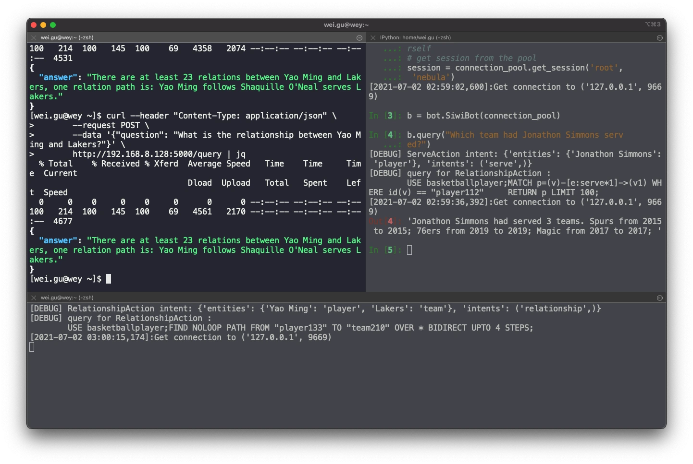
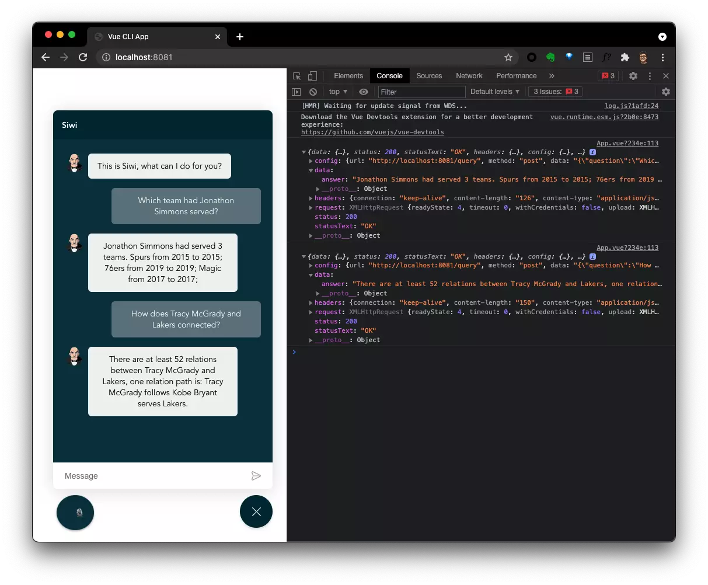

# Siwi the voice assistant

Siwi (/ˈsɪwi/) is a PoC of Dialog System With Graph Database Backed Knowledge Graph.

For now, it's a demo for task-driven(not general purpose) dialog bots with KG(Knowledge Graph) leveraging Nebula Graph with the minimal/sample dataset from [Nebula Graph Manual](https://docs.nebula-graph.io/2.0.1/3.ngql-guide/1.nGQL-overview/1.overview/#basketballplayer)/ [NG中文手册](https://docs.nebula-graph.com.cn/2.0.1/3.ngql-guide/1.nGQL-overview/1.overview/#basketballplayer).

> Tips: Now you can play with the graph online without installing yourself!
>
> [Nebula Playground](https://playground.nebula-graph.io) | [Nebula Playground - China Mainland](https://playground.nebula-graph.com.cn)

Supported queries:

`relation`:

- What is the relationship between Yao Ming and Lakers?
- How does Yao Ming and Lakers connected?

`serving`:
- Which team had Yao Ming served?

`friendship`:
- Whom does Tim Duncan follow?
- Who are Yao Ming's friends?

## Deploy and Try

You can try with it from scratch here: https://katacoda.com/wey/scenarios/siwi-kgqa

## How does it work?

This is one of the most naive pipeline for a specific domain/ single purpose chat bot built on a Knowledge Graph.

### Backend



The Backend(Siwi API) is a Flask based API server:

- Flask API server takes questions in HTTP POST, and calls the bot API.

- In bot API part there are classfier(Symentic Parsing, Intent Matching, Slot Filling), and question actors(Call corresponding actions to query Knowledge Graph with intents and slots).

- Knowledge Graph is built on an Open-Source Graph Database: [Nebula Graph](https://github.com/vesoft-inc/nebula-graph)

### Frontend



The Frontend is a VueJS Single Page Applicaiton(SPA):

- I reused a Vue Bot UI to showcase a chat window in this human-agent interaction, typing is supported.
- In addtion, leverating Chrome's [Web Speech API](https://developer.mozilla.org/en-US/docs/Web/API/Web_Speech_API/Using_the_Web_Speech_API), a button to listen to human voice is introduced

### A Query Flow

```asciiart
┌────────────────┬──────────────────────────────────────┐
│                │                                      │
│                │  Speech                              │
│     ┌──────────▼──────────┐                           │
│     │            Frontend │   Siwi, /ˈsɪwi/           │
│     │ Web_Speech_API      │   A PoC of                │
│     │                     │   Dialog System           │
│     │ Vue.JS              │   With Graph Database     │
│     │                     │   Backed Knowledge Graph  │
│     └──────────┬──────────┘                           │
│                │  Sentence                            │
│                │                                      │
│   ┌────────────┼──────────────────────────────┐       │
│   │            │                              │       │
│   │            │              Backend         │       │
│   │ ┌──────────▼──────────┐                   │       │
│   │ │ Web API, Flask      │   ./app/          │       │
│   │ └──────────┬──────────┘                   │       │
│   │            │  Sentence    ./bot/          │       │
│   │ ┌──────────▼──────────┐                   │       │
│   │ │                     │                   │       │
│   │ │ Intent matching,    │   ./bot/classifier│       │
│   │ │ Symentic Processing │                   │       │
│   │ │                     │                   │       │
│   │ └──────────┬──────────┘                   │       │
│   │            │  Intent, Entities            │       │
│   │ ┌──────────▼──────────┐                   │       │
│   │ │                     │                   │       │
│   │ │ Intent Actor        │   ./bot/actions   │       │
│   │ │                     │                   │       │
│   └─┴──────────┬──────────┴───────────────────┘       │
│                │  Graph Query                         │
│     ┌──────────▼──────────┐                           │
│     │                     │                           │
│     │ Graph Database      │    Nebula Graph           │
│     │                     │                           │
│     └─────────────────────┘                           │
│                                                       │
│                                                       │
│                                                       │
└───────────────────────────────────────────────────────┘
```

### Source Code Tree

```bash
.
├── README.md
├── src
│   ├── siwi                        # Siwi-API Backend
│   │   ├── app                     # Web Server, take HTTP requests and calls Bot API
│   │   └── bot                     # Bot API
│   │       ├── actions             # Take Intent, Slots, Query Knowledge Graph here
│   │       ├── bot                 # Entrypoint of the Bot API
│   │       ├── classifier          # Symentic Parsing, Intent Matching, Slot Filling
│   │       └── test                # Example Data Source as equivalent/mocked module
│   └── siwi_frontend               # Browser End
│       ├── README.md
│       ├── package.json
│       └── src
│           ├── App.vue             # Listening to user and pass Questions to Siwi-API
│           └── main.js
└── wsgi.py
```


## Manually Run Components

### Graph Database

The backend relis on the [Nebula Graph](https://github.com/vesoft-inc/nebula), an Open Source Distributed Graph Database.

Install Nebula Graph in oneliner:

```bash
curl -fsSL nebula-up.siwei.io/install.sh | bash
```

Load the [basketballplayer dataset](https://docs.nebula-graph.com.cn/2.6.2/3.ngql-guide/1.nGQL-overview/1.overview/#basketballplayer).

```bash
~/.nebula-up/console.sh
nebula-console -addr graphd -port 9669 -user root -p nebula -e ":play basketballplayer"
```

### Backend

Install and run.
```bash
# Install siwi backend
python3 -m build

# Configure Nebula Graph Endpoint
export NG_ENDPOINTS=127.0.0.1:9669

# Run Backend API server
gunicorn --bind :5000 wsgi --workers 1 --threads 1 --timeout 60
```

> For OpenFunction/ KNative

```bash
docker build -t weygu/siwi-api .
docker run --rm --name siwi-api \
     --env=PORT=5000 \
     --env=NG_ENDPOINTS=127.0.0.1:9669 \
     --net=host \
     weygu/siwi-api
```

Try it out Web API:
```bash
$ curl -s --header "Content-Type: application/json" \
       --request POST \
       --data '{"question": "What is the relationship between Yao Ming and Lakers?"}' \
       http://192.168.8.128:5000/query | jq

{
  "answer": "There are at least 23 relations between Yao Ming and Lakers, one relation path is: Yao Ming follows Shaquille O'Neal serves Lakers."
}
```

Call Bot Python API:

```python
from nebula3.gclient.net import ConnectionPool
from nebula3.Config import Config

# define a config
config = Config()
config.max_connection_pool_size = 10
# init connection pool
connection_pool = ConnectionPool()
# if the given servers are ok, return true, else return false
ok = connection_pool.init([('127.0.0.1', 9669)], config)

# import siwi bot
from siwi.bot import bot

# instantiate a bot
b = bot.SiwiBot(connection_pool)

# make the question query
b.query("Which team had Jonathon Simmons served?")
```

Then a response will be like this:

```python
In [4]: b.query("Which team had Jonathon Simmons serv
   ...: ed?")

[DEBUG] ServeAction intent: {'entities': {'Jonathon Simmons': 'player'}, 'intents': ('serve',)}

[DEBUG] query for RelationshipAction:
	USE basketballplayer;
  MATCH p=(v)-[e:serve*1]->(v1) WHERE id(v) == "player112"
  RETURN p LIMIT 100;

[2021-07-02 02:59:36,392]:Get connection to ('127.0.0.1', 9669)

Out[4]: 'Jonathon Simmons had served 3 teams. Spurs from 2015 to 2015; 76ers from 2019 to 2019; Magic from 2017 to 2017; '
```


### Frontend

Referring to [siwi_frontend](https://github.com/wey-gu/nebula-siwi/tree/main/src/siwi_frontend)


## Deploy with K8s + OpenFunction


```asciiarmor
 ┌─────────────────────────────┐
 │ kind: Ingress               │     ┌───────────────────┐
 │   path: /                   │     │ Pod               │
 │    -> siwi-frontend     ────┼─────┤  siwi-frontend    │
 │                             │     │                   │
 │                             │     └───────────────────┘
 │                             │
 │   path: /query              │     ┌───────────────────────────────────┐
 │    -> siwi-api          ────┼─────┤ KNative Service                   │
 │       KNative Serving       │     │  serving-xxxx                     │
 │                             │     │                                   │
 │                             │     │ apiVersion: serving.knative.dev/v1│
 │                             │     │ kind: Service                     │
 └─────────────────────────────┘     └─────────┬─────────────────────────┘
                                               │
                                               └────────────┐
                                                            │
 ┌───────────────────────────────────────────────────────┐  │
 │apiVersion: core.openfunction.io/v1alpha1              │  │
 │kind: Function                                         │  │
 │spec:                                                  │  │
 │  version: "v1.0.0"                                    │  │
 │  image: "weygu/siwi-api:latest"                       │  │
 │  imageCredentials:                                    │  │
 │    name: push-secret                                  │  │
 │  port: 8080                                           │  │
 │  build:                                               │  │
 │    builder: openfunction/builder:v1                   │  │
 │    env:                                               │  │
 │      FUNC_NAME: "siwi_api"                            │  │
 │      FUNC_TYPE: "http"                                │  │
 │      FUNC_SRC: "main.py"                              │  │
 │    srcRepo:                                           │  │
 │      url: "https://github.com/wey-gu/nebula-siwi.git" │  │
 │      sourceSubPath: "src"                             │  │
 │  serving:                                             │  │
 │    runtime: Knative  ─────────────────────────────────┼──┘
 │    params:                                            │
 │      NG_ENDPOINTS: "NEBULA_GRAPH_ENDPOINT"            │
 │    template:                          │               │
 │      containers:                      │               │
 │        - name: function               │               │
 │          imagePullPolicy: Always      │               │
 └───────────────────────────────────────┼───────────────┘
                                         │
                              ┌──────────┘
                              │
 ┌────────────────────────────┴───────────────────────────┐
 │apiVersion:lapps.nebula-graph.io/v1alpha1               │
 │kind: NebulaCluster                                     │
 │spec:                                                   │
 │  graphd:                                               │
 │    config:                                             │
 │      system_memory_high_watermark_ratio: "1.0"         │
 │    image: vesoft/nebula-graphd                         │
 │    replicas: 1                                         │
 │...                                                     │
 └────────────────────────────────────────────────────────┘
```

> Assumed we have a k8s with OpenFunctions installed

### Run it!

Install a Nebula Graph with `kubesphere-all-in-one` nebula installer on KubeSphere:

```bash
curl -sL nebula-kind.siwei.io/install-ks-1.sh | bash
```

Get Nebula Graph NodePort:

```bash
NEBULA_GRAPH_ENDPOINT=$(kubectl get svc nebula-graphd-svc-nodeport -o yaml -o jsonpath='{.spec.clusterIP}:{.spec.ports[0].port}')
echo $NEBULA_GRAPH_ENDPOINT
```

Load Dataset into the nebula cluster:

```bash
wget https://docs.nebula-graph.io/2.0/basketballplayer-2.X.ngql

~/.nebula-kind/bin/console -u root -p password --address=<nebula-graphd-svc-nodeport> --port=32669 -f basketballplayer-2.X.ngql
```

Create the siwi-api powered by Openfunction:

```bash
cat siwi-api-function.yaml | sed "s/NEBULA_GRAPH_ENDPOINT/$NEBULA_GRAPH_ENDPOINT/g" | kubectl apply -f -
```

Get the function nebula-siwi and the KNative Service:

```bash
kubectl get functions nebula-siwi

FUNCTION=$(kubectl get functions nebula-siwi -o go-template='{{.status.serving.resourceRef}}')

kubectl get ksvc -l openfunction.io/serving=$FUNCTION

KSVC=$(kubectl get ksvc -l openfunction.io/serving=$FUNCTION -o=jsonpath='{.items[0].metadata.name}')

kubectl get revision -l serving.knative.dev/service=$KSVC

REVISION=$(kubectl get revision -l serving.knative.dev/service=$KSVC -o=jsonpath='{.items[0].metadata.name}')

echo $REVISION
```

Verify the function worked fine:

```bash
curl -s --header "Content-Type: application/json" \
     --request POST \
     --data '{"question": "What is the relationship between Yao Ming and Lakers ?"}' \
     $(kubectl get ksvc -l openfunction.io/serving=$FUNCTION -o=jsonpath='{.items[0].status.url}')/query
```

Create the siwi-app resources on K8s:

```bash
cat siwi-app.yaml | sed "s/REVISION/$REVISION/g" | kubectl apply -f -
```

Verify the function worked fine through the ingress:

> Here nodeport with http port 31059 was used as ingress controller endpoint.

```bash
curl -s --header "Content-Type: application/json" \
     --request POST \
     --data '{"question": "how does Tim Duncan and Lakers connected?"}' \
     demo-siwi.local:31059/query
```

Verify the frontend:

```bash
curl $(kubectl get svc -l app=siwi -o=jsonpath='{.items[0].spec.clusterIP}')
```

Verify the frontend beind the ingress:

```bash
curl demo-siwi.local:31059
```

Get all resources in siwi-app:

```bash
kubectl get service,pod,ingress,function -l app=siwi
```

And it should be something like this:
```bash
[root@wey nebula-siwi]# kubectl get service,pod,ingress,function -l app=siwi
NAME                         TYPE        CLUSTER-IP     EXTERNAL-IP   PORT(S)   AGE
service/siwi-frontend-file   ClusterIP   10.233.60.81   <none>        80/TCP    64m

NAME                     READY   STATUS    RESTARTS   AGE
pod/siwi-frontend-file   1/1     Running   0          64m

NAME                                     CLASS    HOSTS             ADDRESS   PORTS   AGE
ingress.networking.k8s.io/siwi-service   <none>   demo-siwi.local             80      59m

NAME                                        BUILDSTATE   SERVINGSTATE   BUILDER         SERVING         AGE
function.core.openfunction.io/nebula-siwi   Succeeded    Running        builder-sbfz6   serving-vvjvl   26h
[root@wey nebula-siwi]# kubectl get service,pod,ingress,function -l app=siwi
NAME                         TYPE        CLUSTER-IP     EXTERNAL-IP   PORT(S)   AGE
service/siwi-frontend-file   ClusterIP   10.233.60.81   <none>        80/TCP    65m

NAME                     READY   STATUS    RESTARTS   AGE
pod/siwi-frontend-file   1/1     Running   0          65m

NAME                                     CLASS    HOSTS             ADDRESS   PORTS   AGE
ingress.networking.k8s.io/siwi-service   <none>   demo-siwi.local             80      59m

NAME                                        BUILDSTATE   SERVINGSTATE   BUILDER         SERVING         AGE
function.core.openfunction.io/nebula-siwi   Succeeded    Running        builder-sbfz6   serving-vvjvl   26h
```

### How to Build the image

```bash
docker build -t weygu/siwi-frontend . -f Dockerfile.froentend
docker push weygu/siwi-frontend
```


## Further work

- [ ] Use [NBA-API](https://github.com/swar/nba_api) to fallback undefined pattern questions
- [ ] Wrap and manage sessions instead of get and release session per request, this is somehow costly actually.
- [ ] Use NLP methods to implement proper Symentic Parsing, Intent Matching, Slot Filling
- [ ] Build Graph to help with Intent Matching, especially for a general purpose bot
- [ ] Use larger Dataset i.e. from [wyattowalsh/basketball](https://www.kaggle.com/wyattowalsh/basketball)


## Thanks to Upstream Projects ❤️

### Backend

- I learnt a lot from the [KGQA on MedicalKG](https://github.com/liuhuanyong/QASystemOnMedicalKG) created by [Huanyong Liu](https://liuhuanyong.github.io)
- [Flask](https://github.com/pallets/flask)
- [pyahocorasick](https://github.com/WojciechMula/pyahocorasick) created by [Wojciech Muła](http://0x80.pl/)
- [PyYaml](https://pyyaml.org/)

### Frontend

- [VueJS](https://vuejs.org) for frontend framework
- [Vue Bot UI](https://github.com/juzser/vue-bot-ui ), as a lovely bot UI in vue
- [Vue Web Speech](https://github.com/Drackokacka/vue-web-speech ), for speech API vue wrapper
- [Axios](https://github.com/axios/axios ) for browser http client
- [Solarized](https://en.wikipedia.org/wiki/Solarized_(color_scheme)) for color scheme
- [Vitesome](https://github.com/alvarosaburido/vitesome) for landing page design
